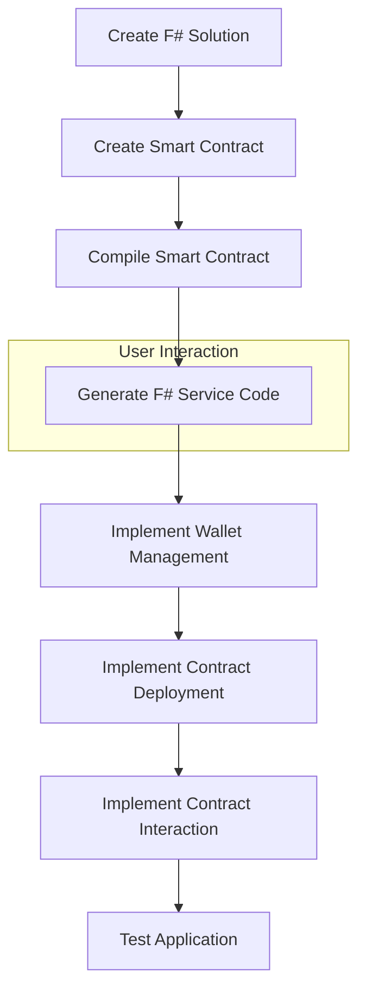

# F# Nethereum Project Plan

## Project Overview

We'll create an F# version of the Nethereum workflow example that:
- Uses the folder name (EvmDevWorkflowExample) as the solution name
- Re-engineers the smart contract using the latest Solidity version
- Connects to the AVAX test network
- Creates and securely saves a Nethereum wallet using the standard keystore format
- Follows a pair programming approach for the code generation step

## Project Structure

```
EvmDevWorkflowExample/
├── EvmDevWorkflowExample.sln
├── SimpleStorage/
│   ├── SimpleStorage.fsproj
│   ├── Program.fs
│   ├── SimpleStorageService.fs (will be generated)
│   ├── Contracts/
│   │   └── SimpleStorage.sol
│   ├── Wallet/
│   │   └── keystore/ (for encrypted wallet files)
```

## Implementation Plan

### 1. Project Setup

1. Create a new F# solution named "EvmDevWorkflowExample"
2. Create a new F# console project named "SimpleStorage"
3. Add the necessary NuGet packages:
   - Nethereum.Web3
   - Nethereum.Accounts
   - Nethereum.KeyStore
   - Nethereum.Autogen.ContractApi

### 2. Smart Contract Development

1. Create a new Solidity file (SimpleStorage.sol) using the latest Solidity version (^0.8.0)
2. Implement the SimpleStorage contract with:
   - A stored value (uint)
   - A set function to update the value
   - A get function to retrieve the value
   - Additional improvements like events and access control

### 3. Wallet Management

1. Create a wallet management module in F#
2. Implement functions to:
   - Create a new wallet using Nethereum's Account.Create()
   - Save the wallet using Account.EncryptAndGenerateDefaultKeyStoreAsJson() to create a standard Ethereum keystore file
   - Load an existing wallet using Account.LoadFromKeyStore()
3. Store additional metadata (like network information) as environment variables

### 4. Contract Deployment and Interaction

1. Configure the connection to the AVAX test network
2. Implement contract deployment functionality
3. Implement functions to interact with the contract:
   - Call the set function
   - Call the get function
4. Add proper error handling and logging

### 5. Code Generation

1. Compile the Solidity contract to generate ABI and bytecode
2. Pause for the user to run the Nethereum code generation in Visual Studio
   - The user will use "Solidity: Code generate FSharp Definitions in Abi files in current folder"
3. Integrate the generated F# service code

## Technical Details

### Smart Contract (Latest Solidity Version)

```solidity
// SPDX-License-Identifier: MIT
pragma solidity ^0.8.19;

contract SimpleStorage {
    uint private storedData;
    event ValueChanged(uint newValue);
    
    function set(uint x) public {
        storedData = x;
        emit ValueChanged(x);
    }
    
    function get() public view returns (uint) {
        return storedData;
    }
}
```

### AVAX Test Network Configuration

We'll use the Avalanche Fuji Testnet with the following configuration:
- Network Name: Avalanche Fuji Testnet
- RPC URL: https://api.avax-test.network/ext/bc/C/rpc
- Chain ID: 43113
- Currency Symbol: AVAX

### Wallet Management

We'll use Nethereum's built-in keystore functionality:
1. Create a wallet: `var account = new Nethereum.Web3.Accounts.Account();`
2. Encrypt and save: `var json = Account.EncryptAndGenerateDefaultKeyStoreAsJson(password, privateKey, address);`
3. Load a wallet: `var account = Account.LoadFromKeyStore(json, password);`

The keystore files will follow the standard Ethereum Web3 Secret Storage format, ensuring compatibility with other Ethereum tools and wallets.

Additional metadata like network information will be stored as environment variables:
- AVAX_TESTNET_URL
- AVAX_TESTNET_CHAINID
- WALLET_PATH

## Implementation Workflow



## Key Differences from C# Example

1. **Language**: Using F# instead of C#
2. **Network**: Using AVAX test network instead of a local Ethereum node
3. **Wallet Management**: Using standard Ethereum keystore format with environment variables for additional metadata
4. **Solidity Version**: Using the latest Solidity version (^0.8.19)
5. **Project Structure**: Organizing code in a more functional way

## Pair Programming Approach

1. I'll guide you through each step of the implementation
2. When we reach the code generation step, I'll pause and let you run the Solidity extension in Visual Studio
3. After code generation, we'll continue with integrating the generated code and implementing the remaining functionality

## Next Steps

1. Create the F# solution and project structure
2. Implement the Solidity smart contract
3. Set up the wallet management system
4. Prepare for code generation
5. Implement contract deployment and interaction